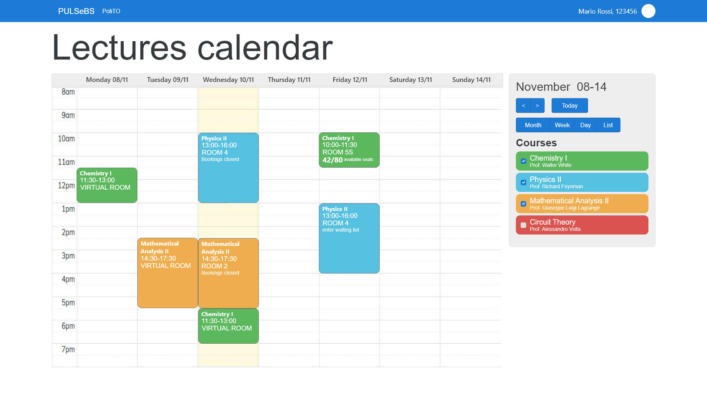
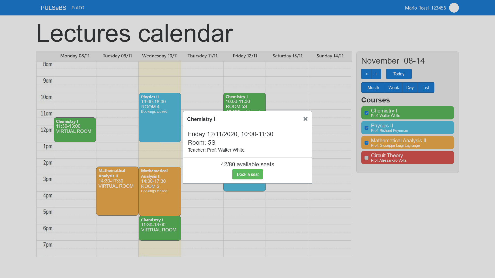
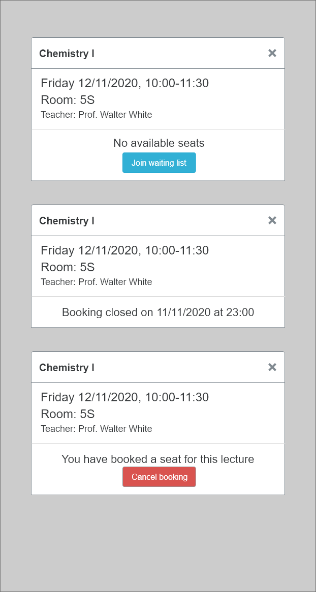
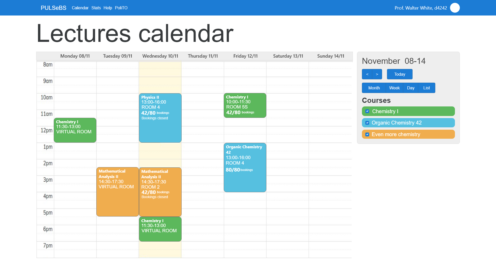
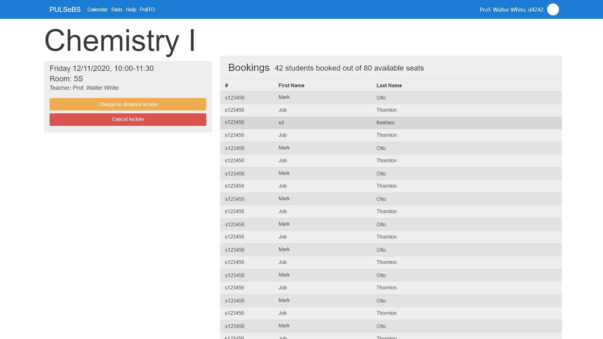

# GUI sketches
For the calendar component used in the following views see [FullCalendar.io](fullcalendar.io).

## Student views
| Lectures calendar student view |
| --- |
| Stories: 1, 5, 6, 13, 22. Notes: |
|  |

| Lectures calendar student view, booking |
| --- |
| Stories: 1, 5, 13. Notes: |
|  |

| Lecture booking modals |
| --- |
| Stories: 1, 5, 13. Notes: |
|  |

## Teacher views
| Lectures calendar teacher view |
| --- |
| Stories: 3, 23. Notes: |
|  |

| Lecture teacher view |
| --- |
| Stories: 3, 7, 9. Notes: |
|  |

## Support officer views

## Booking manager views

