# Test Story 1 10/01/2021

Git branch: `master` 
Commit hash: 'eb69ca3ada4b015bf517911764dd0a98fed9a49e'

 

## Test ID: S1_1

### Step 1

| Screenshot| Notes OR error |
| --- | --- |
| 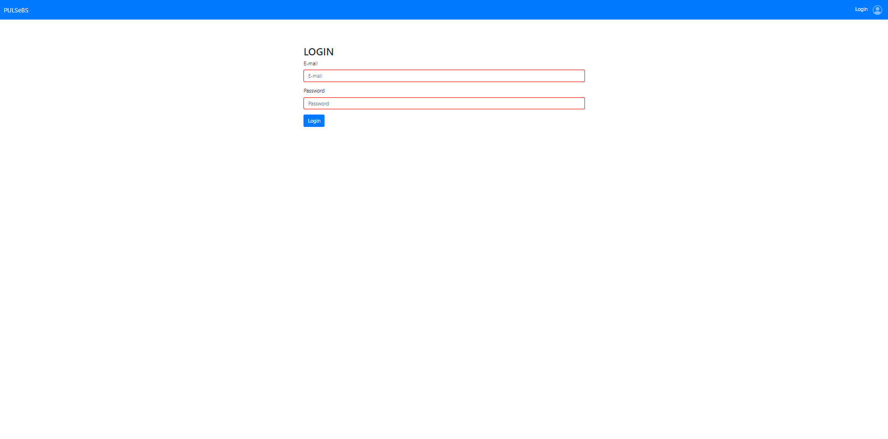 | Entering to login page |
| 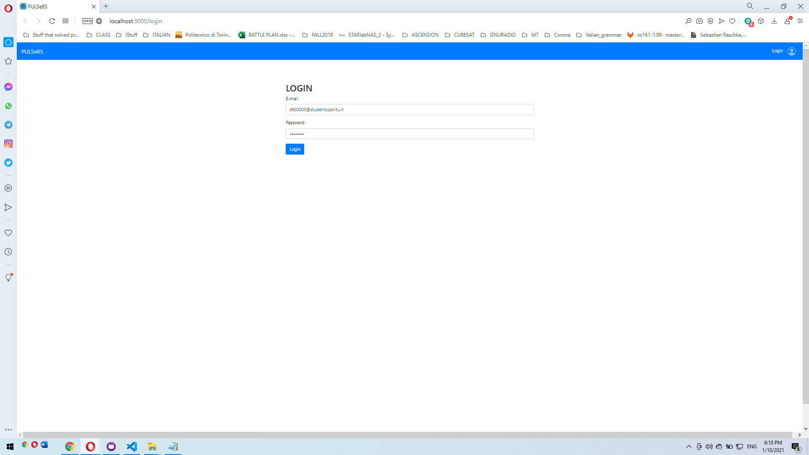 | Entering creditnals and clicking login |

### Step 2

| Screenshot | Notes OR error |
| --- | --- |
| 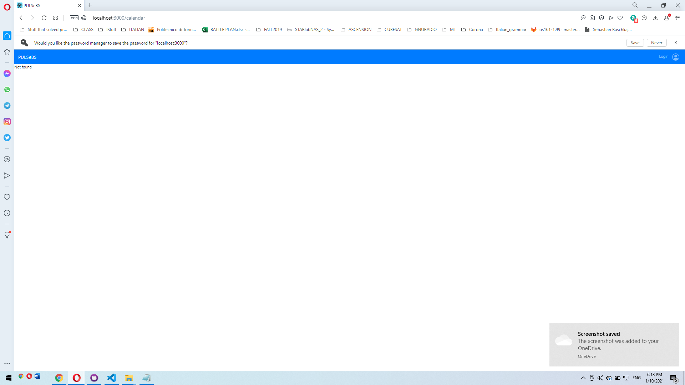 | **ERROR** For a brief moment between clicking login button and redirecting to actual calendar, site displays "not found", then it proceeds |
| 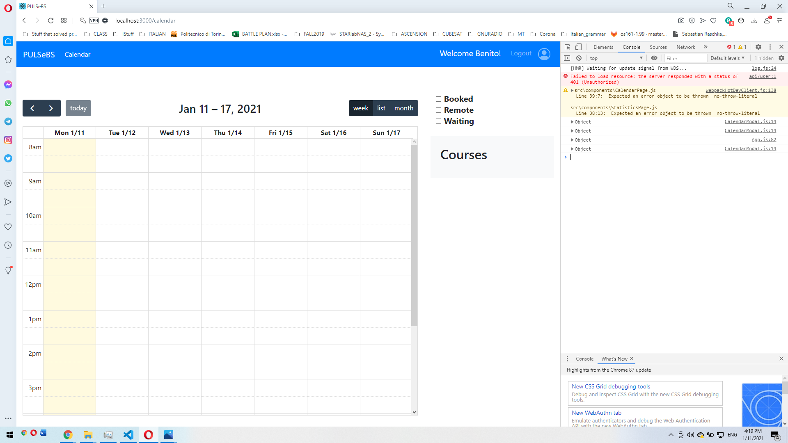 | Console log for the error |
|  | Server terminal |

 

## Test ID: S1_2

### Step 1
| Screenshot | Notes OR error |
| --- | --- |
| 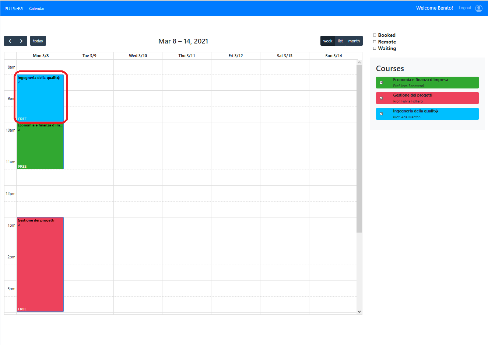 | Selecting a "FREE" lecture |

### Step 2

 

| Screenshot | Notes OR error |
| --- | --- |
| 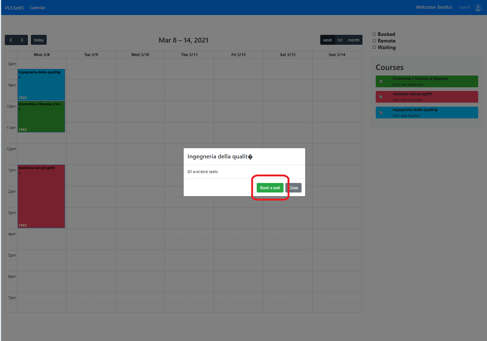 | In appearing pop-up, clicking "book a seat" |
| 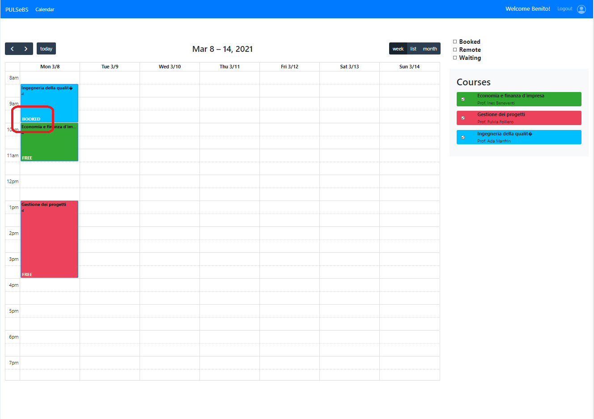 | Status of lecture changed from "FREE" to "BOOKED" |

 

## Test ID: S1_3

### Step 1

| Screenshot | Notes OR error |
| --- | --- |
| 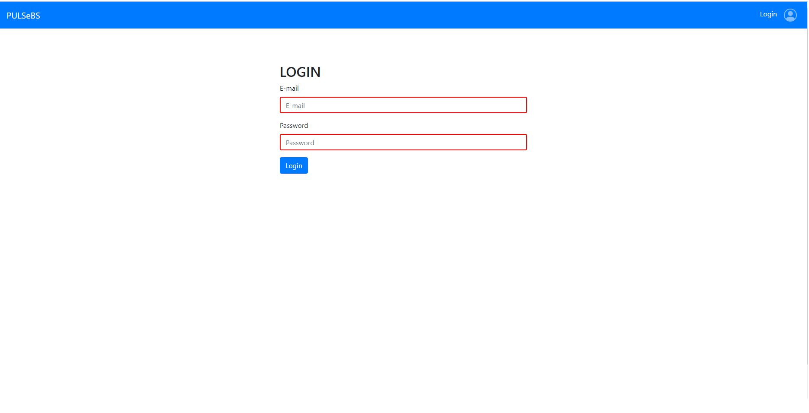 | Visiting login page |

### Step 2

| Screenshot | Notes OR error |
| --- | --- |
| 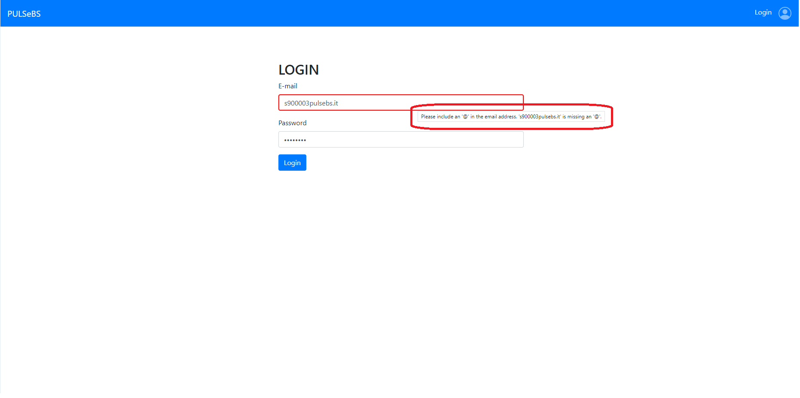 | Insert wrong format causes warning |
| 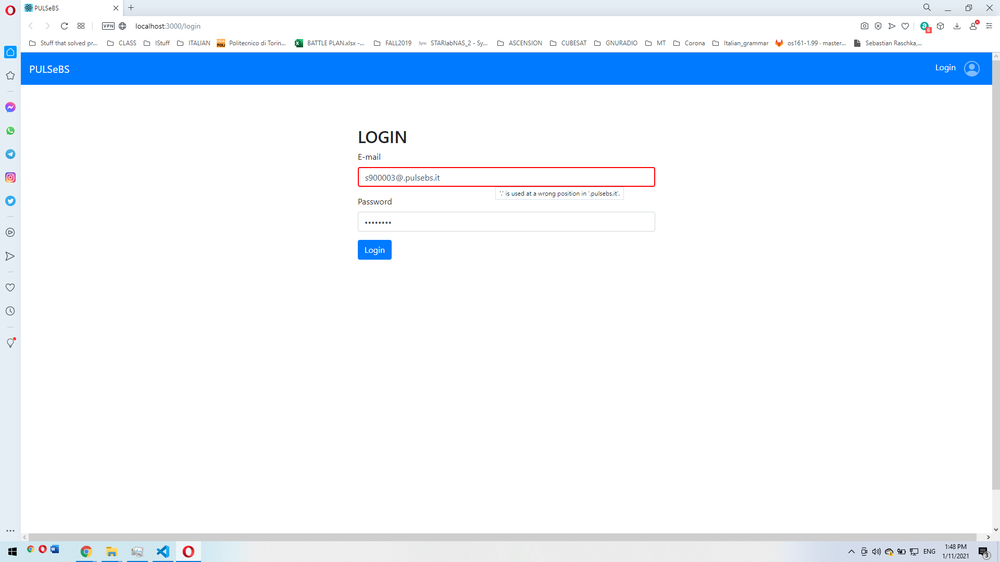 | Insert another wrong format causes warning|

### Step 3

| Screenshot | Notes OR error |
| --- | --- |
|  | After correcting the error in format, warnings disappear|

## Test ID: S1_4

### Step 1

| Screenshot | Notes OR error |
| --- | --- |
| 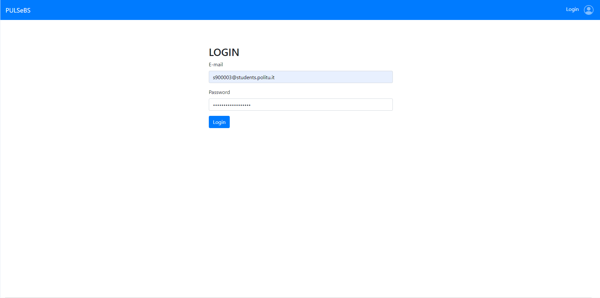 | Visiting login page |

### Step 2

| Screenshot | Notes OR error |
| --- | --- |
| 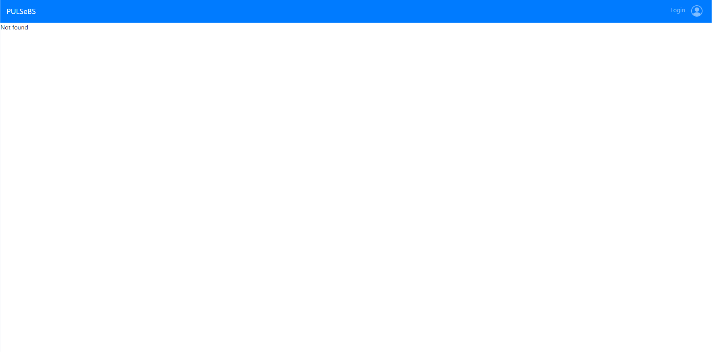 | **ERROR** System does not inform user about the error|
| 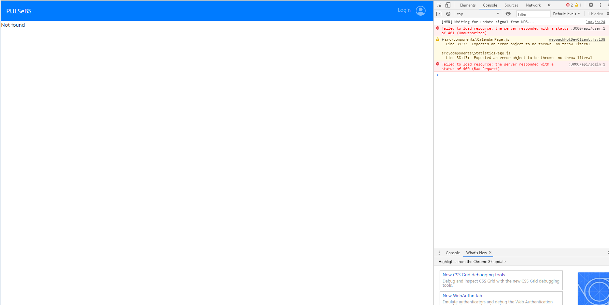 | **ERROR** Console|
|  | **ERROR** Client terminal|
| 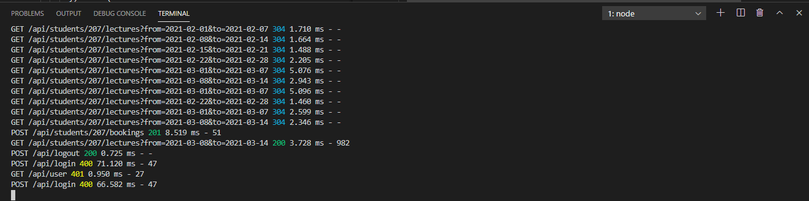 | **ERROR** Server terminal|

## Test ID: S1_5

### Step 1

| Screenshot | Notes OR error |
| --- | --- |
|  | Visiting login page |

### Step 2

| Screenshot | Notes OR error |
| --- | --- |
| 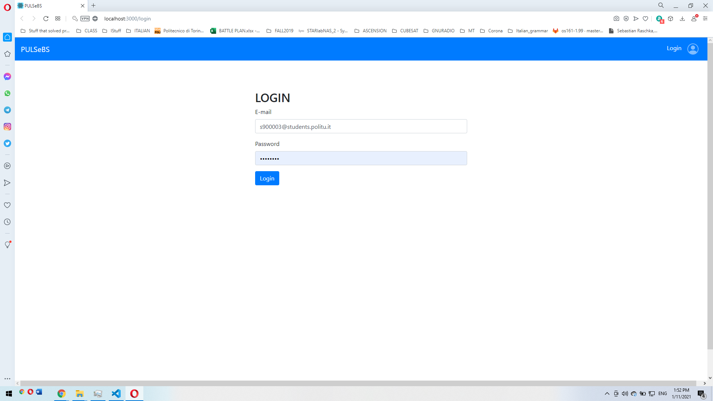 | Entering login creditnals |

### Step 3

| Screenshot | Notes OR error |
| --- | --- |
| 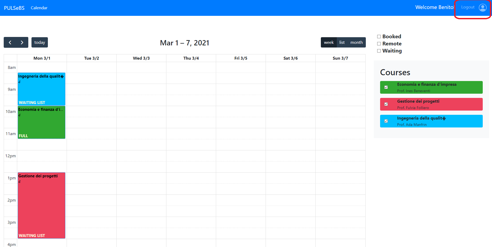 | Pressing "Logout" button |
|  | Successfully logged out |
