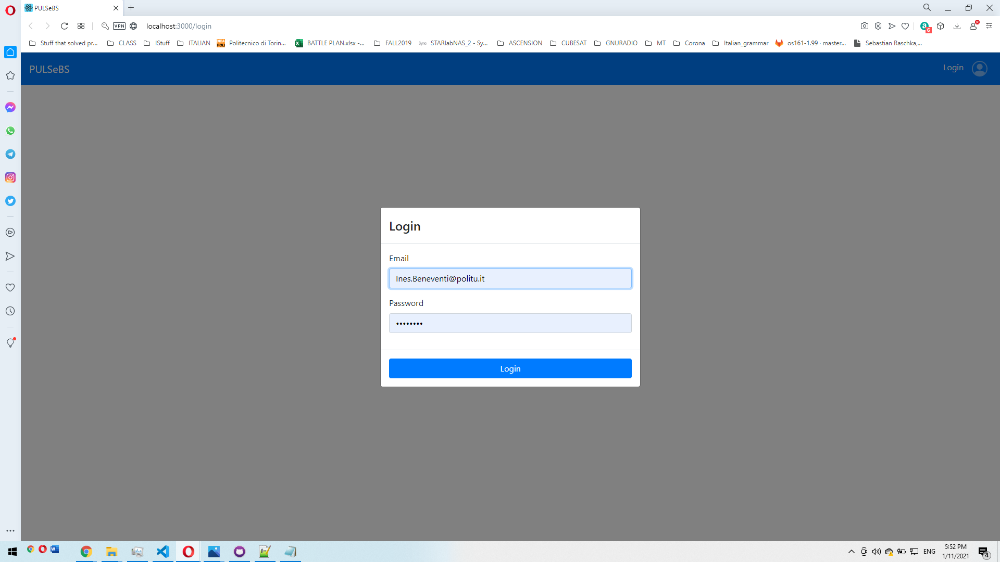
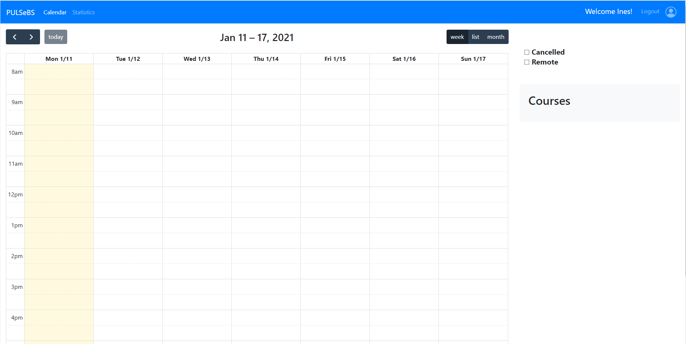
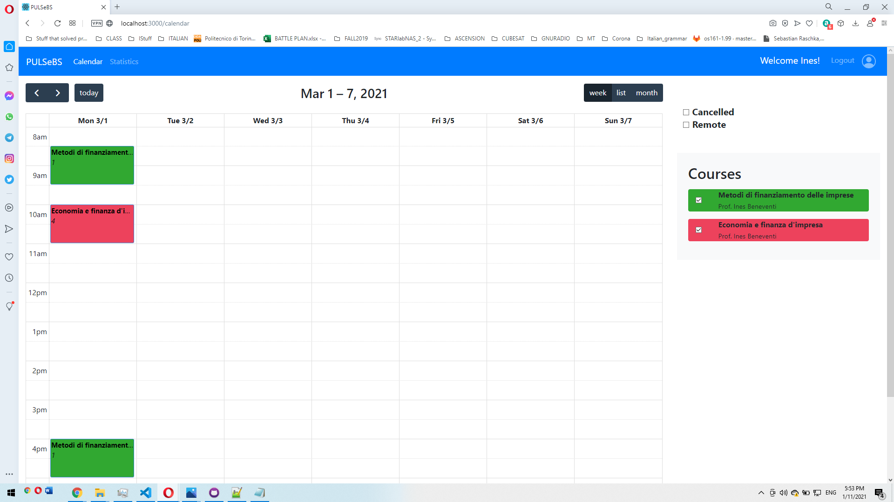
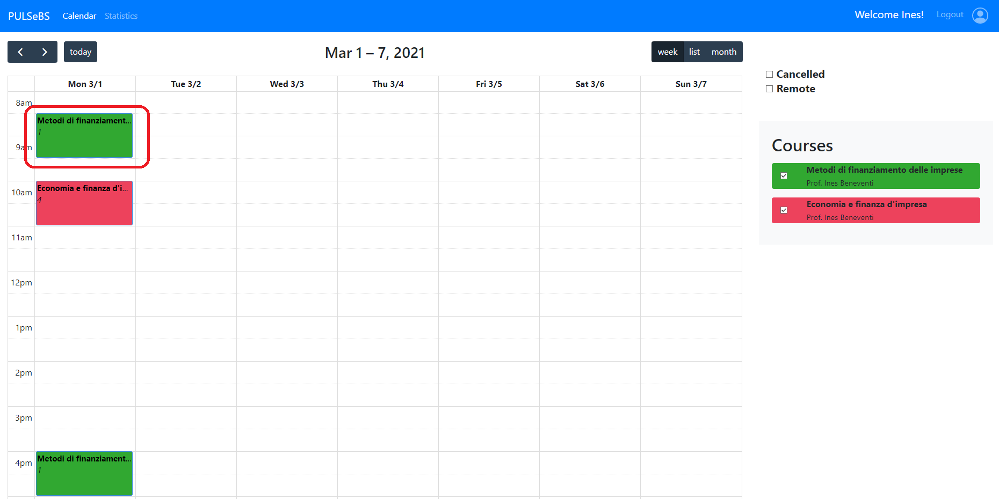
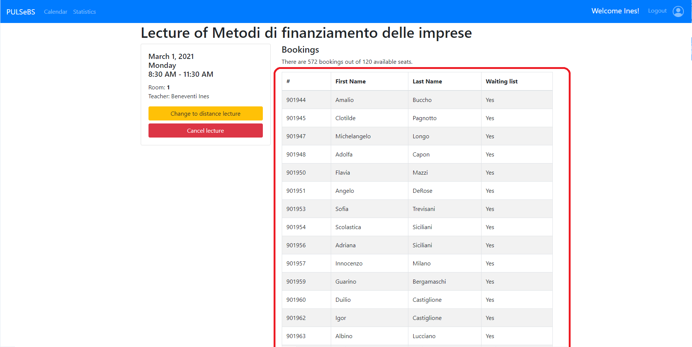

# Test story3 11/01/2021

Git branch: `master` (Make sure you checked out exactly the branch reported)

Commit hash: 'cca13aea725182cb361242fc3206abc7192a9a2c'

 

## Test ID: S3_0

### Step 1

| Screenshot| Notes OR error |
| --- | --- |
|  | Visiting login page |

### Step 2

| Screenshot| Notes OR error |
| --- | --- |
|  | Entering creditnals for teacher and clicking login |
|  | Teacher calendar is visible|
|  | Scrolling to March 1, where first lessons are scheduled |

## Test ID: S3_1

### Step 1

| Screenshot| Notes OR error |
| --- | --- |
|  | Following S3_0, click on "Metodi di..." on March 1, 2021 |
|  | List of students are visible |