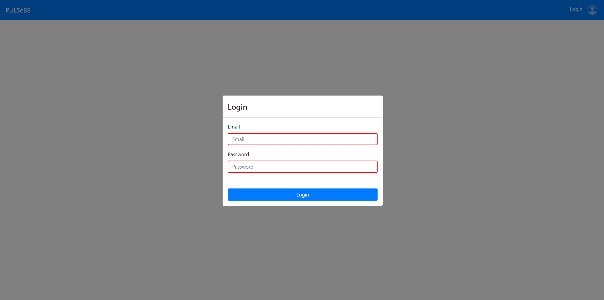
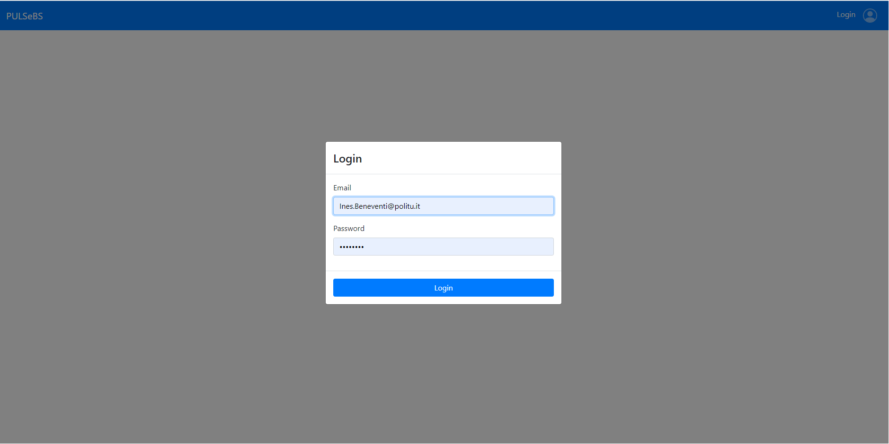
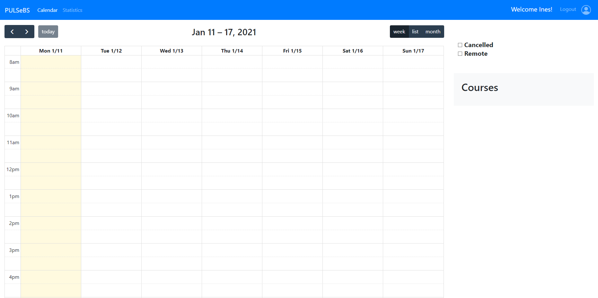
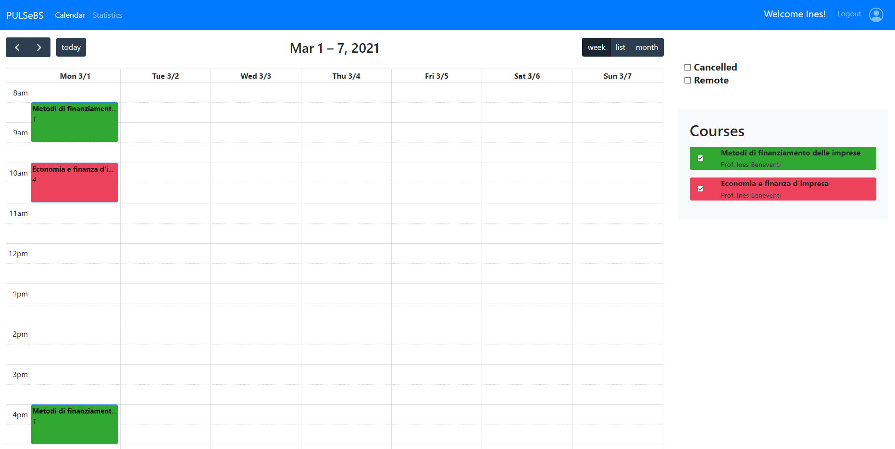
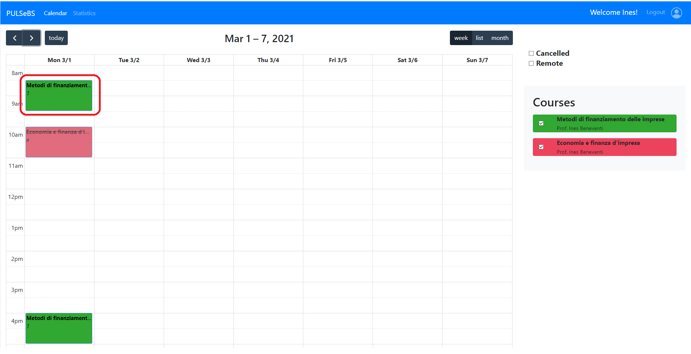
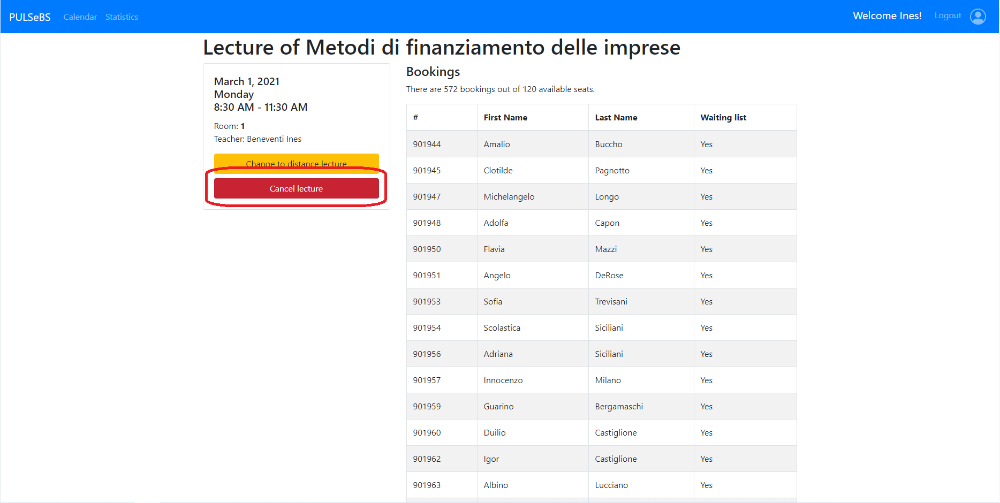
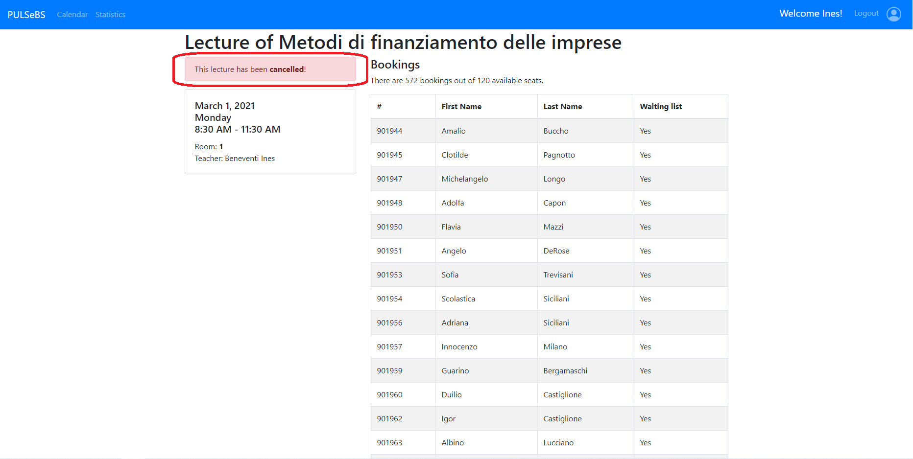
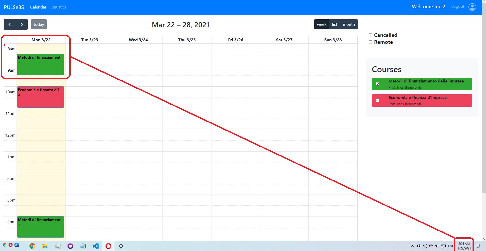
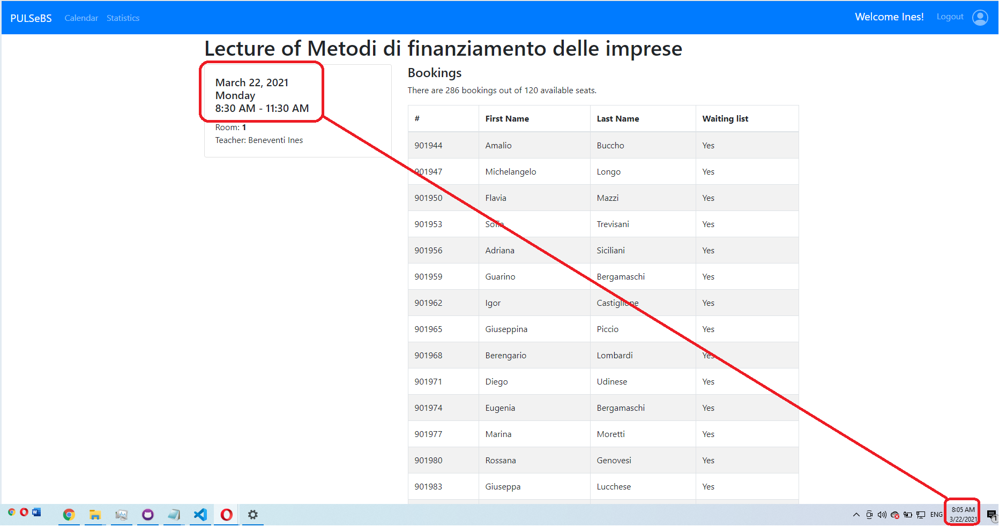

# Test story7 11/01/2021

Git branch: `master` (Make sure you checked out exactly the branch reported)

Commit hash: 'cca13aea725182cb361242fc3206abc7192a9a2c'
 

## Test ID: S7_0

### Step 1

| Screenshot| Notes OR error |
| --- | --- |
|  | Visiting login page |

### Step 2

| Screenshot| Notes OR error |
| --- | --- |
|  | Entering creditnals for teacher and clicking login |
|  | Teacher calendar is visible|
|  | Scrolling to March 1, where first lessons are scheduled |

## Test ID: S7_1

### Step 1

| Screenshot| Notes OR error |
| --- | --- |
|  | Scrolling to March 1, 2021 |
|  | Clicking to "Metodi di finanziamento delle imprese" lecture on Monday 8.30, which has more than 1 hour left to start, considering current date is 11/01/2021 |

### Step 2

| Screenshot| Notes OR error |
| --- | --- |
|  | "Lecture has been cancelled!" message displays | 

 
 

## Test ID: S7_2
### Step 1

| Screenshot| Notes OR error |
| --- | --- |
|  | Selecting lecture that has less than 1 hour to start |
|  | "Cancel Lecture" button is not displayed anymore |