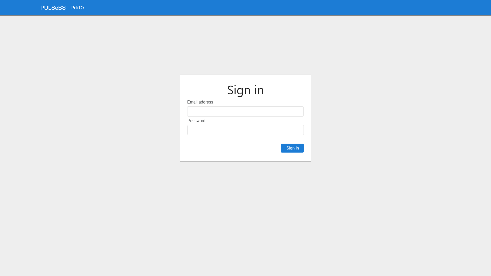

# Test story1 22/12/2020

Git branch: `master` (Make sure you checked out exactly the branch reported)

Commit hash: `b47e8903653070bab048fae93984c7cc729abc8b` (You can obtain this using `git rev-parse HEAD`)

## Test ID: S1_1

### Step 1

| Screenshot | Notes or error |
| --- | --- |
|  | Write specific notes about the actions that you executed that were not in the Manual and feedback on the obtained results. If there have been any errors report them here in **BOLD** to make them more visible. |
| Console screenshot here eventually | **If there has been an error please open the "Inspect" console and take a screenshot of that and report it here"** |

### Step 2

| Screenshot | Notes or error |
| --- | --- |
|  | Blah blah blah... |