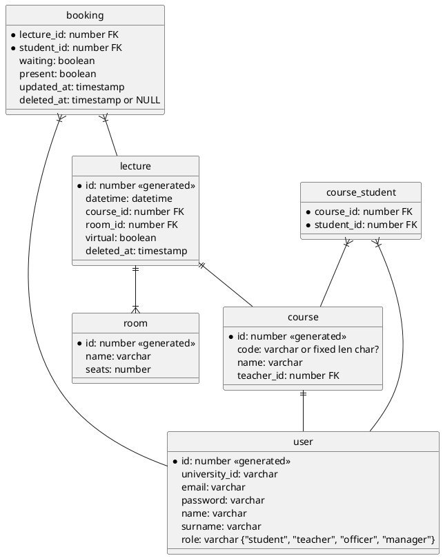

# Database design

To draw this diagram we used  

Here the corresponding "code":

```plantuml
@startuml
' hide the spot
hide circle

entity booking {
*lecture_id: number FK
*student_id: number FK
waiting: boolean
present: boolean
updated_at: timestamp
deleted_at: timestamp or NULL
}

entity user {
*id: number <<generated>>
university_id: varchar
email: varchar
password: varchar
name: varchar
surname: varchar
role: varchar {"student", "teacher", "officer", "manager"}
}

entity course {
*id: number <<generated>>
code: varchar or fixed len char?
name: varchar
teacher_id: number FK
}

entity lecture {
*id: number <<generated>>
datetime: datetime
course_id: number FK
room_id: number FK
virtual: boolean
deleted_at: timestamp
}

entity room {
*id: number <<generated>>
name: varchar
seats: number
}

entity course_student {
*course_id: number FK
*student_id: number FK
}

course_student }|-- user
course_student }|-- course

lecture ||--|{ room

booking }|-- user

booking }|-- lecture
lecture ||-- course
' teacher
course ||-- user
@enduml
```
